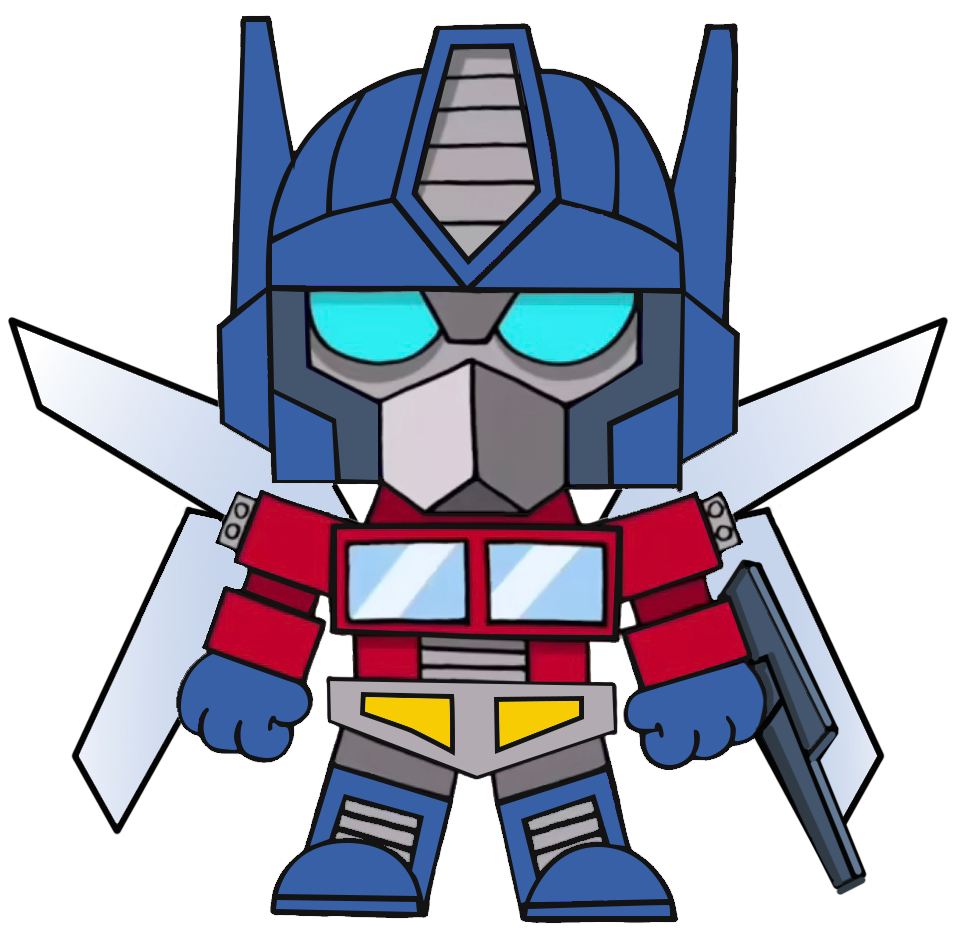
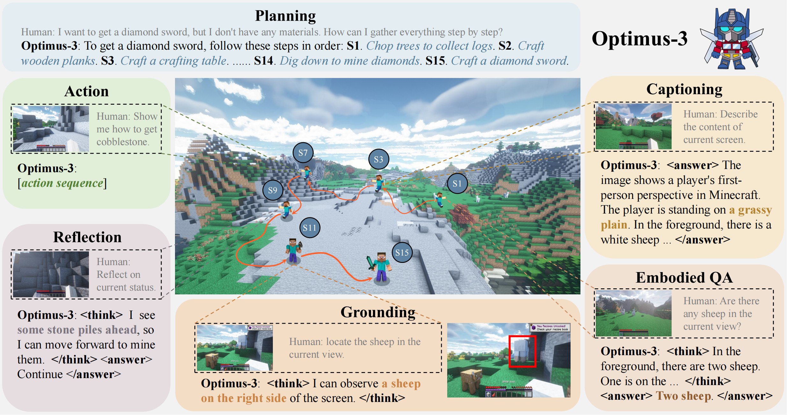
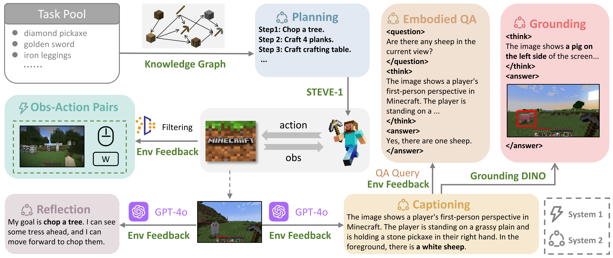
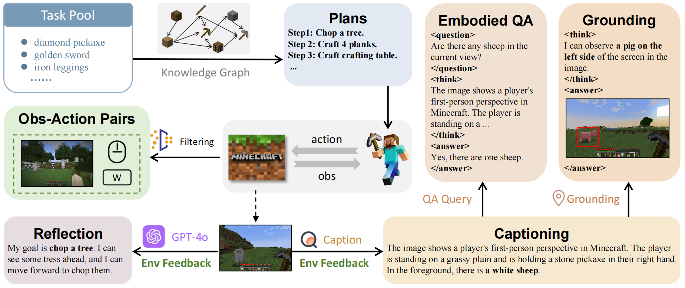
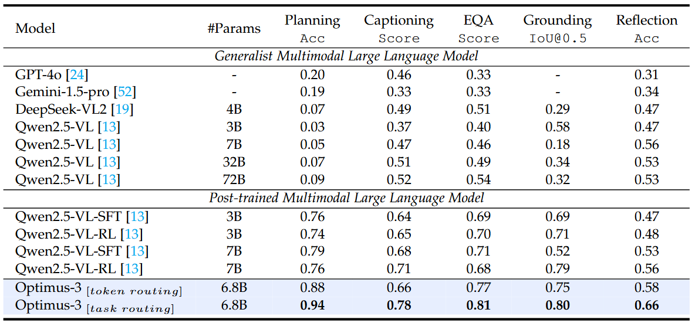
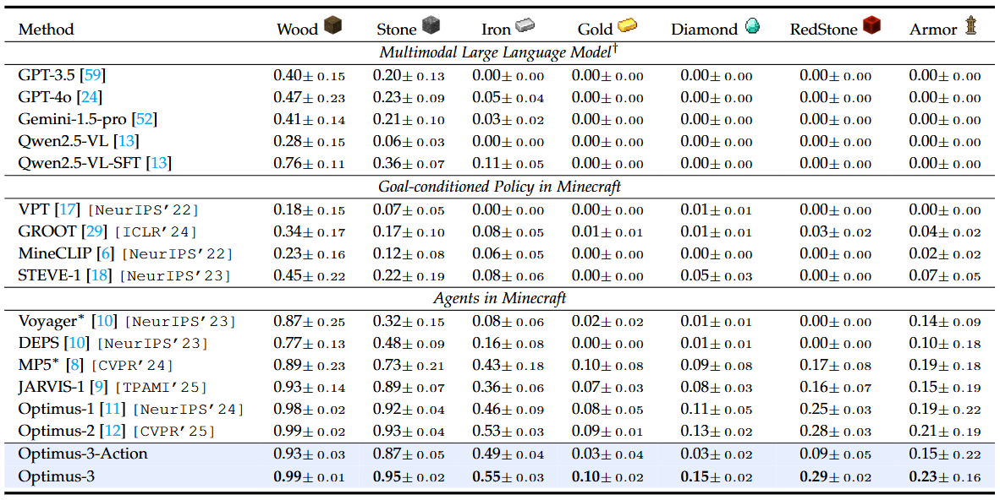

<div align="center">
<h2 align="center">
    <b>Optimus-3: Dual-Router Aligned Mixture-of-Experts Agent 
     <br />  with Dual-Granularity Reasoning-Aware Policy Optimization </b>
</h2>
<div>
<a target="_blank" href="https://scholar.google.com/citations?user=TDBF2UoAAAAJ&hl=en&oi=ao">Zaijing&#160;Li</a><sup>1 2</sup>,
<a target="_blank" href="https://scholar.google.com/citations?user=KO77A2oAAAAJ&hl=en">Yuquan&#160;Xie</a><sup>1</sup>,
<a target="_blank" href="https://scholar.google.com/citations?user=9Vc--XsAAAAJ&hl=en&oi=ao">Rui&#160;Shao</a><sup>1&#9993</sup>,
<a target="_blank" href="https://scholar.google.com/citations?user=Mpg0w3cAAAAJ&hl=en&oi=ao">Gongwei&#160;Chen</a><sup>1</sup>,
<br>
<a target="_blank" href="https://ieeexplore.ieee.org/author/37087008154">Weili&#160;Guan</a><sup>1</sup>,
<a target="_blank" href="https://scholar.google.com/citations?hl=en&user=Awsue7sAAAAJ">Dongmei&#160;Jiang</a><sup>2</sup>,
 <a target="_blank" href="https://scholar.google.com/citations?hl=en&user=yywVMhUAAAAJ">Liqiang&#160;Nie</a><sup>1&#9993</sup>
</div>
<sup>1</sup>Harbin Institute of Technology,Shenzhen&#160&#160&#160</span>
<sup>2</sup>Peng Cheng Laboratory, Shenzhen</span>
<br />
<sup>&#9993&#160;</sup>Corresponding author&#160;&#160;</span>
<br/>
<div align="center">
    <a href="https://arxiv.org/abs/2506.10357" target="_blank">
    </a>
    <a href="https://cybertronagent.github.io/Optimus-3.github.io/" target="_blank">
    </a>
</div>
</div>

## :new: Updates
- [03/2026] :fire: We release the Optimus-3-v2 ([Huggingface](https://huggingface.co/MinecraftOptimus/Optimus-3-v2)) and MineSys2 Benchmark.
- [02/2026] :fire: We release the demo video on [YouTobe](https://www.youtube.com/watch?v=0VOT4PMgf7Y).
- [06/2025] :fire: We release the Optimus-3-preview on [Huggingface](https://huggingface.co/MinecraftOptimus/Optimus-3).
- [06/2025] :fire: [Project page](https://cybertronagent.github.io/Optimus-3.github.io/) and code released.
- [06/2025] :fire: [Arxiv paper](https://arxiv.org/abs/2506.10357) released.

## :rocket: Optimus-3 

Given the task "Craft a diamond sword based on the current inventory", Optimus-3 employs Captioning to perceive and interpret the inventory information, Grounding to select appropriate tools, Planning to generate sub-goals based on available materials, Action to execute these sub-goals sequentially, Reflection to assess the current task state, and Embodied QA to verify whether the task has been successfully completed. 


## :smile: Play with Optimus-3
[](https://www.youtube.com/watch?v=0VOT4PMgf7Y)

We provide an interactive interface that enables users to interact with Optimus-3 in Minecraft in real time through a GUI. You can interact with Optimus-3 through instructions to perform Planning, Long-horizon Actions, Captioning, Embodied QA, and Grounding. This is a framework with a separation between the server and client. You can deploy the model on the server (we strongly recommend a GPU with at least 32GB of VRAM), and then initiate interaction with the server from your local machine at any time. Download the Optimus-3-preview version on [Huggingface](https://huggingface.co/MinecraftOptimus/Optimus-3).

### Server
Server are deployed on machines with a GPU with at least 28GB of VRAM.
```shell
# install java 8
sudo apt install openjdk-8-jdk
sudo apt install xvfb

# install uv
curl -LsSf https://astral.sh/uv/install.sh | sh

# download the repo
git clone https://github.com/JiuTian-VL/Optimus-3.git
cd Optimus-3

# environment setting
uv sync
source .venv/bin/activate
uv pip install -r requirements.txt

# Minestudio setting
# We have made some modifications to the original MineStudio. Please use the version we provided.
cd MineStudio
uv pip install -e .
cd ..

# install LLaMA-Factory
git clone https://github.com/hiyouga/LLaMA-Factory.git
cd LLaMA-Factory
uv pip install -e ".[torch,metrics]"

# install flash-attention
uv pip install flash-attn --no-build-isolation

# download checkpoints
mkdir checkpoint
download Optimus-3 mllm (https://huggingface.co/MinecraftOptimus/Optimus-3) into folder 'checkpoint'
download Optimus-3 action head (https://huggingface.co/MinecraftOptimus/Optimus-3-ActionHead) into folder 'checkpoint'
download Optimus-3 task router (https://huggingface.co/MinecraftOptimus/Optimus-3-Task-Router) into folder 'checkpoint'
download original sentence-bert (https://huggingface.co/efederici/sentence-bert-base) into folder 'checkpoint'

# change the ckpt path
change the optimus3 (actionhead,mllm,task router) checkpoint path in gui_server.py (line 229)
change the optimus3 task router checkpoint path in ./src/minecraftoptimus/model/agent/optimus3.py (line 64)
change the sentence-bert checkpoint path in ./src/minecraftoptimus/model/optimus3/modeling_task_router.py (line 11)

# Communication IP settings
input the ip of your server in gui_server.py (line 459)
```

### Client
The client is deployed on your local machine.
```shell

# download the repo
git clone https://github.com/lizaijing/OptimusGUI.git
cd OptimusGUI

# Configuring the python environment
Some basic python packages, e.g., python>=3.11 pyqt6 requests numpy...

# Communication IP settings
input the ip of your server in main.py (line 11) and server/api.py (line 12)
```

### How to run
```shell

# start the server
python gui_server.py

# start the client
python main.py

# note 
If you encounter an error about the 'collection', change collections to collections.abc in the corresponding location.
If you encounter an error about the 'model_type', you can change the model_type (line 22) into "qwen2_5_vl" in /checkpoint/Optimus3/config.json
```

## :smile_cat: Evaluation on MineSys2 Benchmark
Download the Optimus-3-v2 version on [Huggingface](https://huggingface.co/MinecraftOptimus/Optimus-3-v2).
```shell

# geenrate response in parallel
## change the MODEL path to Optimus-3-v2, you can dowmload it on [Huggingface](https://huggingface.co/MinecraftOptimus/Optimus-3-v2)
bash scripts/optimus3/eval/benchmark_generate.sh

# Evaluation Results
## For the caption and vqa, we employ MLLM as evaluator.
## change the ChatGPT api key in JUDGE_API_KEY, and JUDGE_LLM you like.
bash scripts/optimus3/eval/benchmark_eval.sh

```


## :wrench: Data Generation Pipeline

Given a task pool, we utilize a knowledge graph to generate task plans, forming the planning dataset. These plans are then used as instructions for STEVE-1, which interacts with the environment to produce the action dataset. During this process, we randomly sample images and employ expert models with environmental feedback to generate the captioning, embodied QA, and grounding datasets.


## :balloon: Framework


A: Overview of Optimus-3. Given observations and instructions, Optimus-3 couples System-1 fast reaction (Action) and System-2 deliberate reasoning (Embodied QA, Planning, Grounding, Reflection) within the Dual-Router Aligned MoE architecture. B: The details of Dual-Router Aligned MoE architecture. Horizontally, Task Router assigns each input to its corresponding task expert together with a shared knowledge expert. Vertically, Layer Router accelerates latency-sensitive action inference by selectively skipping intermediate layers. Both routing decisions are made once before the forward pass. C: Performance comparison of Optimus-3 against current task-specific SOTA agents, GPT-4o, and Qwen2.5-VL


## :smile_cat: Evaluation results

Table 1: Main Result of Optimus-3 on MineSys2 Benchmark.


Table 2: Main Result of Optimus-3 on Long-Horizon Benchmark.


## :hugs: Citation

If you find this work useful for your research, please kindly cite our paper:

```
@article{li2025optimus,
  title={Optimus-3: Dual-Router Aligned Mixture-of-Experts Agent with Dual-Granularity Reasoning-Aware Policy Optimization},
  author={Li, Zaijing and Xie, Yuquan and Shao, Rui and Chen, Gongwei and Guan, Weili and Jiang, Dongmei and Wang, Yaowei and Nie, Liqiang},
  journal={arXiv preprint arXiv:2506.10357},
  year={2025}
}
```


